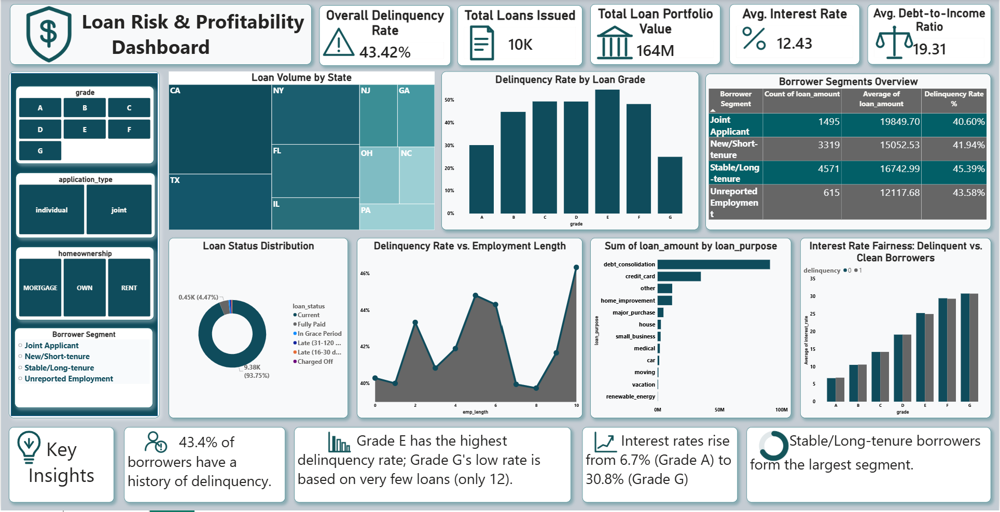

# Loan Risk & Profitability Dashboard

## Project Overview

This project is a **Power BI Loan Risk & Profitability Dashboard** built using the Lending Club loan dataset. The dashboard provides insights into loan portfolio performance, borrower credit risk, delinquency trends, and profitability metrics.

The objective of this project is to help financial institutions identify high-risk borrower segments, monitor loan performance, and evaluate whether interest rates are aligned with borrower risk.

---

## Dashboard Preview




---

## Key KPIs

* **Total Loans Issued:** 10K
* **Total Loan Portfolio Value:** $164M
* **Average Interest Rate:** 12.43%
* **Average Debt-to-Income Ratio:** 19.31
* **Overall Delinquency Rate:** 43.42%

---

## Dashboard Features

* **Portfolio Overview:** Total loans, loan amount, average interest rate, and DTI.
* **Risk Analysis:** Delinquency rate by loan grade and employment length.
* **Profitability Analysis:** Interest rate comparison across loan grades.
* **Borrower Segmentation:** Loan count, average loan amount, and delinquency rate by borrower segment.
* **Geographic Analysis:** Loan volume distribution by state.
* **Loan Purpose Analysis:** Total loan amount by loan purpose.
* **Interactive Slicers:** Grade, application type, homeownership, and employment length filters.

---

## Dataset Information

The dataset contains information about borrowers, loan details, credit history, and loan performance. Key columns used in this project include:

* `loan_amount`
* `interest_rate`
* `grade`
* `loan_status`
* `debt_to_income`
* `annual_income`
* `emp_length`
* `purpose`
* `state`
* `delinq_2y`

---

## Data Cleaning & Transformation

The following data cleaning steps were performed:

* Replaced missing values in **months_since_last_delinq**, **months_since_90d_late**, and **months_since_last_credit_inquiry** with **999** to indicate no history.
* Replaced missing values in **emp_length** with **-1** to represent unknown employment length.
* Handled missing categorical values such as **emp_title** with **Unknown**.
* Created calculated columns and measures in Power BI using DAX.

---

## DAX Measures

### Delinquency Rate %

```DAX
Delinquency Rate % =
DIVIDE(
    CALCULATE(COUNTROWS('Table'), 'Table'[delinq_2y] > 0),
    COUNTROWS('Table')
)
```

This measure calculates the percentage of borrowers who had at least one delinquency in the last two years.

---

## Key Insights

* **43.4%** of borrowers have a history of delinquency.
* **Grade E** borrowers exhibit the highest delinquency rate, making them the riskiest segment.
* Higher-risk grades are charged higher interest rates, confirming risk-based pricing.
* Stable/Long-tenure borrowers account for the largest share of the loan portfolio.
* Debt consolidation is the largest loan purpose, indicating borrowers primarily use loans to manage existing debt.

---

## Tools & Technologies Used

* **Power BI** – Dashboard creation and visualization
* **DAX** – Calculated measures and columns
* **Excel / CSV** – Data cleaning and preprocessing
* **GitHub** – Project version control and portfolio showcase

---

## Business Outcome

This dashboard enables stakeholders to:

* Identify high-risk borrower segments.
* Monitor delinquency trends across loan grades.
* Evaluate loan portfolio profitability.
* Understand borrower behavior and loan purpose distribution.
* Make data-driven lending and risk management decisions.

---

## Repository Structure

```text
Loan-Risk-Profitability-Dashboard/
│
├── lending_club_dataset.csv
│
├── Loan_Risk_Profitability_Dashboard.pbix
│
├── dashboard.png
│
└── README.md
```

⭐ If you found this project useful, please consider giving it a star on GitHub!
